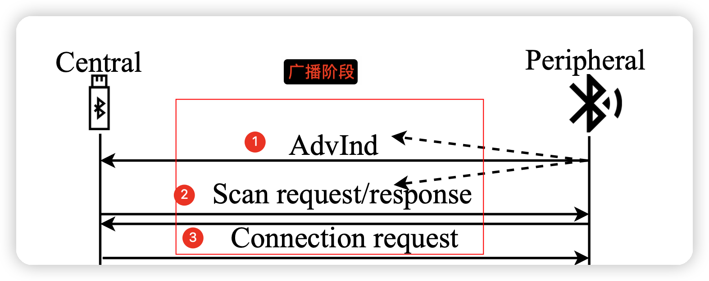
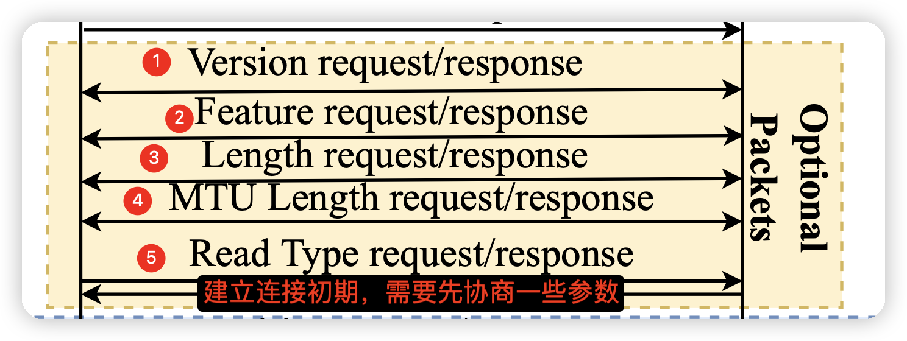
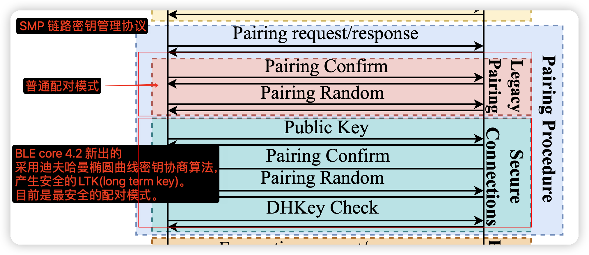
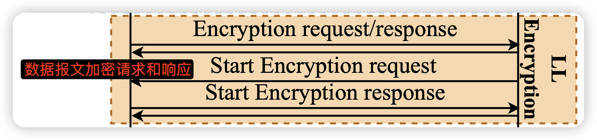
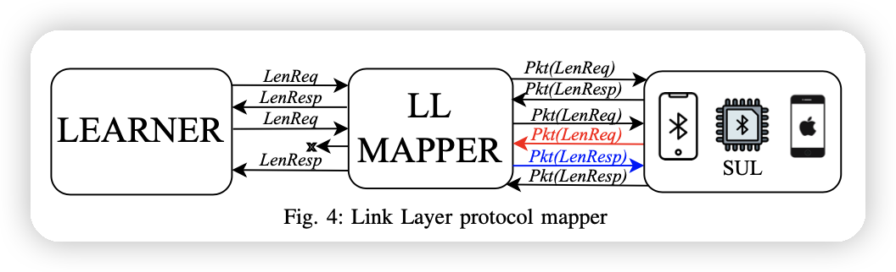
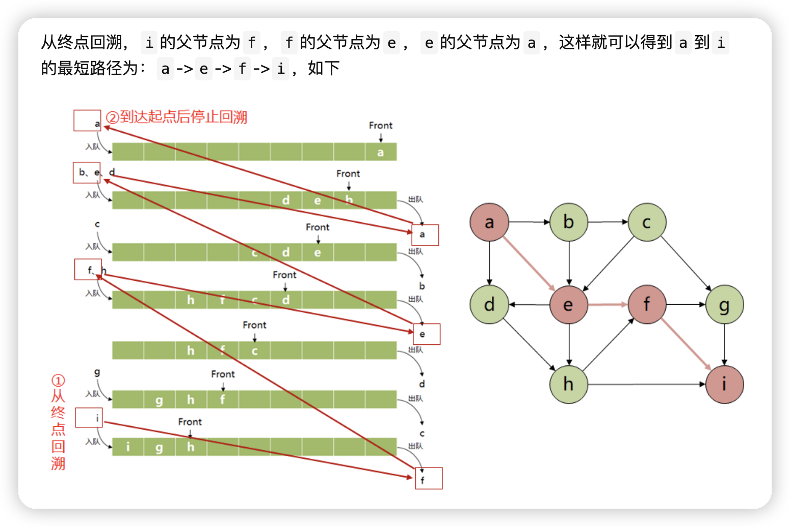

<!--
 * @Description: 
 * @Author: your name
 * @version: 
 * @Date: 2023-09-25 22:21:59
 * @LastEditors: your name
 * @LastEditTime: 2023-10-04 08:22:10
-->
# 引言

> Performing non-compliance checking in a black-box fashion makes BLEDiff agnostic to the device’s underlying embedded operating systems, peripherals, and programming languages, and thus en-ables it to cover a diverse set of BLE devices with different in-put/output capabilities, many of which were not studied before.

* 方法论
> we use a Finite State Machine (FSM) as the input-output protocol abstraction and use the FSM to identify diverse noncompliant behavior.For automatically extracting the protocol FSM of BLE implementations, BLEDiff relies on an active FSM learning approach.

    * 自动机理论
>In FSM learning, the learner starts from a known initial state, sends a sequence of over-the-air protocol messages (queries) to the device-under-test, and, based on the responses to the queries, infers the FSM of the underlying protocol implementation.  

* 现有论文的缺陷
> active FSM learning often fail to learn security- critical interactions and to complete FSM exploration.

* BLEFiff 采取的方法
> BLEDiff divides the BLE protocol into multiple sub-protocols
> 说白了就是 把 子协议 都分开 进行学习

* 贡献
1. We propose BLEDiff an automated, scalable, property and reference FSM-agnostic noncompliance checking framework that analyzes and uncovers vulnerabilities in BLE implementations based on automata learning and identifying deviant behavior.
2. To the best of our knowledge, we are the first to utilize the idea of dividing and conquering the state space to address the scalability of automata learning in FSM extraction.
3. We design a BLE checking module that automatically identifies deviations at higher depths of an FSM compared to the state-of-the-art.
4. 挖到了很多漏洞

* 项目开源地址： https://github.com/BLEDiff

# 背景介绍

* BLE 工作流程

** 广播阶段

* 建立连接1

* 建立连接2

* 若采用BLE 安全连接模式

finite state machine (M)
6-tuple (S, S0,Ψ, Σ, Λ, Ω)
==》 M=[S, S0,Ψ, Σ, Λ, Ω]
* 数学表示 M(S, S0,Ψ, Σ, Λ, Ω) 1x6阶矩阵
1. S is a finite set of states
2. S0 ∈S is the initial state of the FSM（学习前的初始值）
3. Σ and Λ are the sets of input and output alphabets （这个可以理解为 学习到的 语法树 或者 各状态间的 对应关系 也即 BLE 状态树）

The output of BLEDiff is ∆i which induces the deviant behavior.

* 他们参考的开源项目
1. 出自 NCCgroup(又是这群大哥 太狠了) https://github.com/nccgroup/BLESuite.git
2. 

* what is BFS distance
https://studies.nawaz.org/posts/breadth-first-search-and-finding-the-distance-between-two-nodes/

* 这个链接讲的 比较清楚  （最短路径算法）
https://www.khanacademy.org/computing/computer-science/algorithms/breadth-first-search/a/the-breadth-first-search-algorithm#:~:text=Breadth%2Dfirst%20search%20assigns%20two,path%20from%20the%20source%20vertex.

* 本方法LL层与其他方法的 区别
We design our LL mapper differently from all the previous works [14], [15], [21].
[14]J. De Ruiter and E. Poll, “Protocol state fuzzing of tls implementations,” in Proceedings of the 24th USENIX Conference on Security Symposium, ser. SEC’15. USA: USENIX Association, 2015, p. 193206.

[15]P. Fiterau-Brostean, B. Jonsson, R. Merget, J. de Ruiter, K. Sagonas, and J. Somorovsky, “Analysis of DTLS implementations using protocol state fuzzing,” in 29th USENIX Security Symposium (USENIX Security 20). USENIX Association, Aug. 2020, pp. 2523–2540. [Online]. Available: https://www.usenix.org/conference/ usenixsecurity20/presentation/fiterau- brostean

[21]S. R. Hussain, I. Karim, A. A. Ishtiaq, O. Chowdhury, and E. Bertino, “Noncompliance as deviant behavior: An automated black-box noncompliance checker for 4g lte cellular devices,” in Proceedings of the 2021 ACM SIGSAC Conference on Computer and Communications Security, ser. CCS ’21. New York, NY, USA: Association for Computing Machinery, 2021, p. 10821099. [Online]. Available: https://doi.org/10.1145/3460120.3485388

### mapping 方法论
* (i) it sends a response to the peripheral internally without notifying the *learner* about the output;

* (ii) waits for the response of previously send request; 
* (iii) whenever it receives the response for the previous input request, the response is passed to the learner. Thus the mapper completely abstracts the peripheral-triggered LL requests and let the learner learn a consistent FSM of the peripheral.

### 对于 BLE random addressing 类设备的学习机制
> 设备每次被重置时，其MAC地址（可解析私有地址的缘故）都会被更改。
* To learn the address, we design a probing and set-subtraction method where the learner first probes for a time period T1 to get a set of available BLE devices A.
* 

## For BLEDiff we use invariants
*  A connection has to be established before sending any other symbol; 
*  After disconnection and before establishing a connection, all the symbols will be ignored;
*  No security protected messages will be sent without establishing the necessary keys.

BFS(广度优先搜索)
https://vdn6.vzuu.com/SD/d5105682-6549-11eb-b74a-e65cac020e85.mp4?pkey=AAWlKl5hm_XgPpTojw-gKGzr1MuVs7k6WT_DrdAmqdeateHM0e3C5rTgonedi_mgXjfBmBux59ABwPeNdBW3I-M5&c=avc.0.0&f=mp4&pu=078babd7&bu=078babd7&expiration=1696385196&v=ks6

* 

* 参考资料
https://zhuanlan.zhihu.com/p/346666812
https://www.geeksforgeeks.org/breadth-first-search-or-bfs-for-a-graph/
https://www.programiz.com/dsa/graph-bfs

* pydot:https://github.com/pydot/pydot
